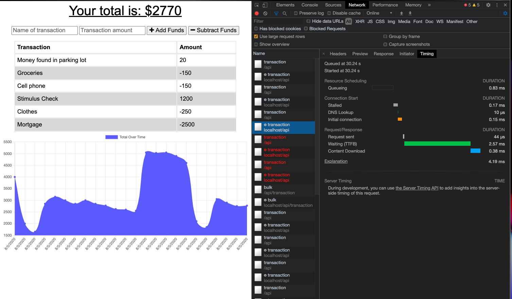
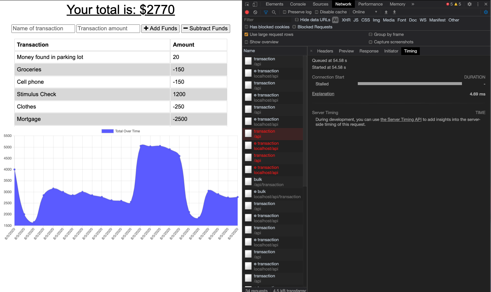
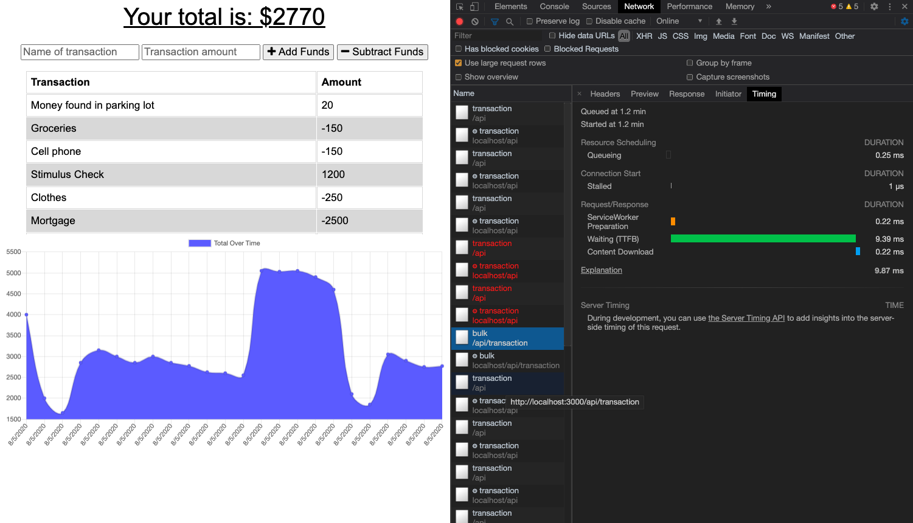
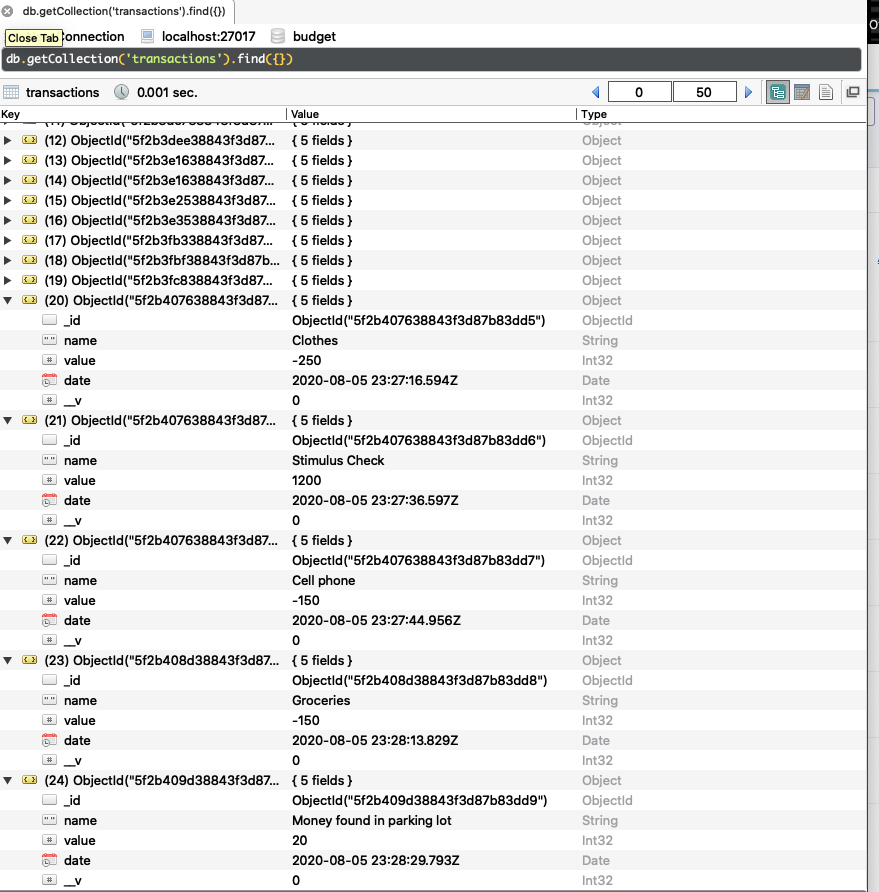

# Project Name 
Budget Tracker
Add expenses and deposits to a budget sheet online or offline. After entering transactions offline with this app, the total populates when brought back online so you never lose your information!! It can be used to track cash, checking, savings, or any other monetary investments. 

## Table of Contents:
  - [Links](#Links)
  - [GIFs](#GIFs)
  - [Motivation](#Motivation)
  - [Installation](#Installation)
  - [How to use](#How_to_use)
  - [Tests](#Tests)
  - [License](#License)
  - [Contribute](#Contribute)
  - [Screenshots and Vids](#Screenshots_and_Vids)

  ## Links
  - [Heroku](https://budget-tracker-for-you.herokuapp.com/) to use the app.
  - [GitHub Pages](https://jmeggles.github.io/Budget_Tracker/) to view README.
  - [GitHub Repo](https://github.com/jmeggles/Budget_Tracker) to view the code.

 ## GIFs 
 ### *Additional video and screenshots* [here](#Screenshots_and_Vids)
  - 
  - 

  
  ## Motivation
  Trackers help people keep info for reference.  It's not easy remembering how or where money is spent so this tracker will help give a timeline of income vs outcome so you know how much your spending and what's in the bank.  Not only does this work online, but offline as well!  So, no probelm if you lose internet connection, it will include entries either way and when back on line, the database is updated with all entries. 

  ## Installation 
  No installation needed.  Open with this link [Heroku](https://budget-tracker-for-you.herokuapp.com/).

  ## How_to_use
  Follow link to deploy app and enter the name of a transaction, then the amount, click either subtract funds if you spent money or add funds if you received income.  

  ## Credits
  John Dinsmore, Jorge Alvarez, & Ben Benson with *WebDev Tutoring*

  ## Tests
  No testing was done prior to project build however, Console logs were used along the way.    

  ## License 
  [MIT License](https://opensource.org/licenses/MIT) 
   

  Copyright © 2020 Jody Eggleston 

  ## Contribute
  For comments and/or questions, contact Jody Eggleston via 
  [Linkedin](https://www.linkedin.com/in/jody-eggleston/)

   ## Screenshots_and_Vids 
  - 
  - 
  - 
  - 
  -   
  - 
  -   
  - 
